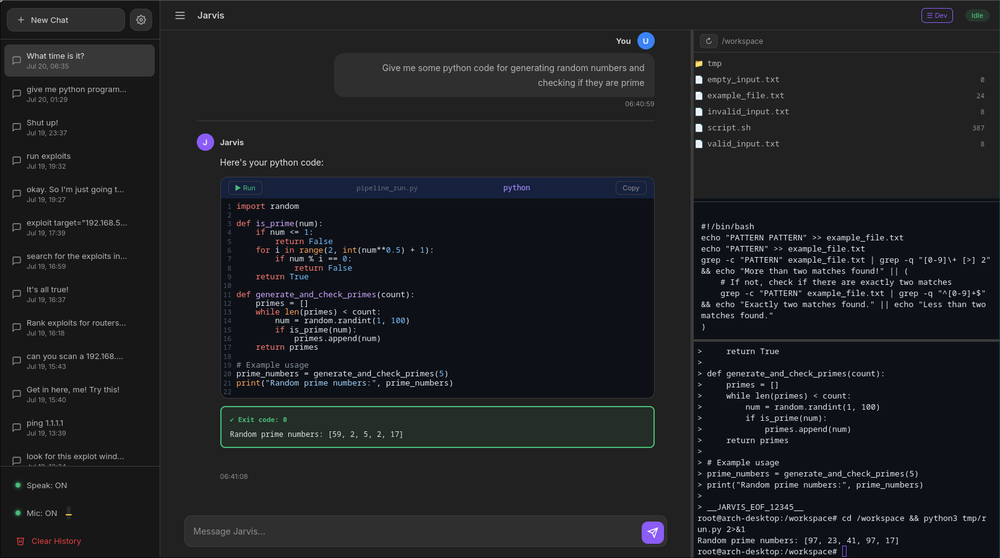

<div align="center">

# J.A.R.V.I.S.

**Just A Rather Very Intelligent System**

A local voice + text AI assistant running on your machine.
Powered by Whisper, Ollama, and edge-tts — fully offline-capable, no API keys required.



```
  ╔═════════════════════════════════════════════════════════╗
  ║  Voice In → Whisper → LLM → Voice Out                   ║
  ║  Web GUI ↕ Chat Logs ↕ Multi-session                    ║
  ║  Code → Pipeline Verify → Compile → Test → Present      ║
  ╚═════════════════════════════════════════════════════════╝
```

</div>

---

## Features

| Feature | Details |
|---|---|
| **Voice Recognition** | Whisper (base.en) with CUDA GPU acceleration, noise filtering & VAD |
| **Text-to-Speech** | edge-tts neural voices — streaming via FIFO for low latency |
| **LLM Backend** | Ollama (Mistral by default) — runs fully locally |
| **Web GUI** | ChatGPT-style interface at `localhost:8765` — code blocks, timestamps, multi-chat |
| **Multi-Chat** | Create, switch, and delete chat sessions from the sidebar |
| **Noise Filtering** | WebRTC VAD + Whisper confidence thresholds reject mumbling & background noise |
| **Code Block Support** | Language labels, line numbers, copy button, run command — TTS skips code |
| **Execution Output** | Code output displayed in a green output block below the code |
| **Mic & Speaker Toggle** | Mute microphone or disable TTS from the sidebar |
| **Auto-Responder** | Watches for voice transcripts and processes commands |
| **Verification Pipeline** | Adaptive task-oriented pipeline: Classify → Build Graph → Execute task-specific nodes. 17 task types with verification DAGs. |
| **Terminal Integration** | Pipeline commands appear in a visible Docker terminal via WebSocket |
| **Security Intelligence** | CVE database (2750+), exploit ranking, target profiling, PoC generation |
| **Camera Feed** | Live MJPEG camera feed in webui with voice commands |

---

## Quick Start

### Prerequisites

- Python 3.10+
- NVIDIA GPU with CUDA (optional, for Whisper GPU acceleration)
- Ollama installed and running
- Audio devices configured (PulseAudio/PipeWire)

### Install

```bash
git clone https://github.com/YOUR_USERNAME/jarvis.git
cd jarvis
bash setup.sh
```

This will:
1. Create a Python virtual environment
2. Install all dependencies from `requirements.txt`
3. Pull the default Ollama model (Mistral)
4. Create the config file at `~/.config/jarvis/settings.json`

### Start (test first)

```bash
# Test — runs in foreground (Ctrl+C to stop)
bash start_jarvis.sh
```

This launches all components (voice, web UI, terminal) in one terminal. Use this to verify everything works.

### Run as a Service (recommended)

Once verified, set up as a systemd service so it runs in the background and auto-starts on login:

```bash
# Copy the service template
mkdir -p ~/.config/systemd/user
cp jarvis.service ~/.config/systemd/user/

# Enable and start
systemctl --user daemon-reload
systemctl --user enable jarvis.service
systemctl --user start jarvis.service

# Manage
systemctl --user status jarvis.service
systemctl --user restart jarvis.service
systemctl --user stop jarvis.service

# View logs
journalctl --user -u jarvis.service -f
```

### Run individual components

```bash
source venv/bin/activate
python webui.py       # Web UI only
python jarv2.py       # Voice only
```

Then open `http://localhost:8765` in your browser.

---

## Configuration

### Environment Variables

All network/device settings are configurable via environment variables:

| Variable | Default | Description |
|---|---|---|
| `JARVIS_PI_HOST` | `192.168.0.111` | Raspberry Pi IP address |
| `JARVIS_PI_USER` | `pi` | SSH username for Pi |
| `JARVIS_PI_CAMERA_URL` | `http://$PI_HOST:5000` | Camera stream URL |
| `JARVIS_MSF_PATH` | `/opt/metasploit/modules/exploits` | Metasploit modules path |
| `JARVIS_CUDA_LIB` | *(empty)* | CUDA library path for GPU acceleration |

Example:
```bash
export JARVIS_PI_HOST=192.168.1.100
export JARVIS_PI_USER=pi
bash start_jarvis.sh
```

### Settings File

User preferences are stored at `~/.config/jarvis/settings.json`:

```json
{
  "tts_voice": "en-US-SteffanNeural",
  "ollama_model": "mistral",
  "whisper_model": "base.en",
  "energy_threshold": 500,
  "num_ctx": 4096
}
```

Change the TTS voice to any [supported voice](https://learn.microsoft.com/en-us/azure/ai-services/speech-service/language-support).

### Camera / Raspberry Pi

If you have a Raspberry Pi camera, set the environment variables and use voice commands:
- "camera snapshot" — capture a single frame
- "live camera feed" — stream MJPEG feed in the web UI
- "set FPS to 15" — change camera framerate

---

## Usage

### Voice Commands

Speak naturally — Jarvis filters noise and only responds to clear speech.

| Say this | Jarvis does this |
|---|---|
| "what time is it" | Tells you the current time |
| "open YouTube" / "open Reddit" | Opens the site in your browser |
| "run / write a script that..." | Generates and runs a code |
| "stop" / "cancel" / "nevermind" | Aborts current operation |
| Anything else | Sends to Ollama for AI response |

### Web Interface

**Sidebar controls:**
- **+ New Chat** — start a fresh session
- **Click a chat** — switch between sessions
- **Speak: ON/OFF** — toggle TTS output
- **Mic: ON/OFF** — toggle microphone input
- **Clear History** — delete all chat logs

Type directly in the input bar — your message gets a response just like voice.

---

## Architecture

```
┌─────────────────────────────────────────────────────────┐
│  jarv2.py           Voice loop: mic → Whisper → text    │
│  auto_responder.sh  Command router: text → LLM → speech │
│  webui.py           Web UI: ChatGPT-style interface     │
│  pipeline.py        Adaptive verification (17 types)    │
│  ask.py             LLM query handler + routing         │
│  ws_server.py       Terminal WebSocket + HTTP endpoint  │
│  docker_env.py      Docker sandbox for code execution   │
│  rag.py             Conversation indexing + search      │
│  config.py          Central config (paths, env vars)    │
│  security_db/       CVE database, exploit ranking       │
└─────────────────────────────────────────────────────────┘
```

---

## File Structure

```
jarvis/
├── jarv2.py              # Voice loop: mic → Whisper → transcript
├── auto_responder.sh     # Command brain: transcript → Ollama → response
├── webui.py              # Web GUI at localhost:8765
├── ws_server.py          # Terminal WebSocket (:8766) + HTTP (:8767)
├── pipeline.py           # Adaptive verification pipeline
├── docker_env.py         # Docker sandbox for code execution
├── rag.py                # Conversation indexing and RAG search
├── ask.py                # LLM query handler
├── config.py             # Central config (all paths + env vars)
├── start_jarvis.sh       # Launch all components
├── setup.sh              # Installer (venv + deps + config)
├── requirements.txt      # Python dependencies
├── jarvis.service        # Systemd service template
├── security_db/          # Security intelligence system
│   ├── knowledge.json    # CVE database (2750+ entries)
│   ├── bridge.py         # Main interface
│   ├── ranker.py         # Exploit ranking
│   ├── profiler.py       # Target profiling
│   ├── guide.py          # Adaptation guides
│   └── pentest.py        # Pentest execution engine
└── workspace/            # Docker-mapped workspace
```

Chat sessions are stored at `~/.local/share/jarvis/chats/`.

---

## Systemd

See the [Quick Start](#run-as-a-service-recommended) section for full service setup commands.

---

## Troubleshooting

**Mic not working:**
```bash
python -c "import speech_recognition as sr; print(sr.Microphone.list_microphone_names())"
```

**Ollama not responding:**
```bash
ollama serve &
ollama pull mistral
curl http://localhost:11434/api/tags
```

**Web UI not loading:**
```bash
curl http://localhost:8765
```

**Stuck mic/speaker states:**
```bash
rm /tmp/jarvis_mic_muted /tmp/jarvis_tts_muted
```

---

## License

This project is licensed under the MIT License — see the [LICENSE](LICENSE) file for details.
